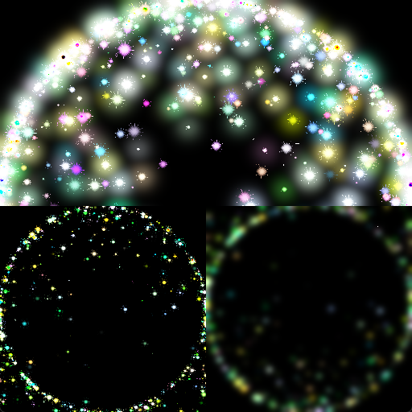

# OpenGL Shader Programming Lab

C++/OpenGL 렌더러에 GPU 파티클, 다중 렌더 타깃과 bloom 후처리 파이프라인을 구현한 개인 그래픽스 프로젝트입니다.

<p align="center">
  
</p>

<p align="center"><sub>최종 bloom 합성과 디버그 렌더 타깃 — 왼쪽 아래: bright-pass, 오른쪽 아래: blur</sub></p>

| 항목 | 내용 |
| --- | --- |
| 개발 기간 | 2025.09 ~ 2025.12 |
| 개발 형태 | 개인 학습 프로젝트 |
| 플랫폼 | Windows |
| 기술 | C++, OpenGL, GLSL 3.30, GLEW, freeglut |
| 개발 환경 | Visual Studio 2022, MSVC v143 |

## 구현 범위

수업에서 제공된 최소 OpenGL 프레임워크를 바탕으로 다음 렌더링 기능을 확장했습니다.

- 2,500개 파티클 속성을 VBO로 전달하고 이동·알파를 GLSL에서 계산
- HDR framebuffer와 MRT를 이용한 원본·밝은 영역 동시 출력
- ping-pong framebuffer 기반 Gaussian blur
- tone mapping, gamma correction과 bloom 합성
- grid mesh, 다중 texture와 여러 화면 효과 실습
- 실행 중 shader program 재컴파일

## 렌더링 파이프라인

### GPU 파티클

파티클 하나를 6개 정점의 쿼드로 구성해 하나의 VBO에 저장합니다. 위치, 색상, 시작 시각, 속도, 수명, 질량, 주기와 UV를 정점 속성으로 전달하고, vertex shader에서 이동과 수명에 따른 알파를 계산합니다. 기본 실행 경로는 원형 이동이며 사인 곡선·중력 이동은 실험용 코드로 남겨 두었습니다.

fragment shader는 파티클 텍스처와 색을 결합한 뒤 밝기 임계값을 판정합니다.

### MRT와 bloom

1. `GL_RGBA16F` HDR FBO의 두 color attachment에 원본 파티클과 밝은 영역을 동시에 기록합니다.
2. 밝기 값이 1을 넘는 픽셀만 bloom 입력으로 분리합니다.
3. 두 ping-pong FBO를 오가며 가로·세로 Gaussian blur를 반복합니다.
4. 원본 HDR 텍스처와 blur 결과를 합성합니다.
5. exponential tone mapping과 gamma correction을 적용해 출력합니다.

화면 하단의 두 디버그 뷰에서 bright-pass와 blur 중간 결과를 최종 합성과 함께 확인할 수 있습니다.

### 추가 셰이더 실습

- 500×500 grid mesh와 파동·깃발 형태의 vertex 변형
- 여러 texture unit을 사용한 숫자·이미지 합성
- FBO와 다중 color attachment를 이용한 off-screen rendering
- 렌즈, 어안, 중력 렌즈, 빗방울, 색수차, CRT, 필름과 픽셀화 효과

실습 shader는 [`SimpleGame/Shaders`](SimpleGame/Shaders)에 있으며 기본 실행 경로는 bloom 파이프라인입니다.

## 코드 구성

| 구현 위치 | 역할 |
| --- | --- |
| [`SimpleGame.cpp`](SimpleGame/SimpleGame.cpp) | freeglut 초기화, 렌더 루프, shader reload 입력 |
| [`Renderer.cpp`](SimpleGame/Renderer.cpp) | VBO, texture, FBO/MRT와 draw pass 관리 |
| [`particle.vs`](SimpleGame/Shaders/particle.vs) | 파티클 위치와 수명 계산 |
| [`particle.fs`](SimpleGame/Shaders/particle.fs) | 원본과 bright-pass 동시 출력 |
| [`Texture.fs`](SimpleGame/Shaders/Texture.fs) | Gaussian blur, tone mapping, gamma correction |

## 빌드와 실행

Visual Studio 2022의 **Desktop development with C++** 워크로드와 OpenGL 3.3 이상을 지원하는 그래픽 드라이버가 필요합니다. 저장소에는 x64용 `freeglut.dll`과 `glew32.dll`이 포함되어 있습니다.

1. [`SimpleGame.sln`](SimpleGame.sln)을 엽니다.
2. `Release | x64`를 선택합니다.
3. **Debugging > Working Directory**를 `$(ProjectDir)`로 설정합니다.
4. 빌드 후 실행합니다. 실행 중 `1` 키를 누르면 GLSL program을 다시 읽어 컴파일합니다.

```powershell
msbuild .\SimpleGame.sln /m /p:Configuration=Release /p:Platform=x64
Set-Location .\SimpleGame
..\x64\Release\SimpleGame.exe
```

## 빌드·실행 확인

2026-08-08 Visual Studio 2022·MSVC v143 환경에서 `Release | x64` 빌드, OpenGL 창 실행, bloom 합성과 bright-pass·blur 디버그 뷰를 확인했습니다. 빌드는 성공하지만 외부 LodePNG 코드와 일부 렌더러 형 변환 관련 경고가 남아 있습니다.

## 개선 방향

512×512로 고정된 FBO를 창 크기에 맞추고, 프레임 의존 시간 갱신과 shader reload 시 이전 program 해제(`glDeleteProgram`)를 보완할 예정입니다.

## 외부 코드와 라이브러리

초기 프레임워크의 사용 조건은 [`SimpleGame.cpp`](SimpleGame/SimpleGame.cpp)에, LodePNG 고지문은 [`LoadPng.cpp`](SimpleGame/LoadPng.cpp)에 보존되어 있습니다. GLEW와 freeglut을 포함한 외부 의존성은 배포 전에 라이선스와 버전을 다시 확인해야 합니다.

